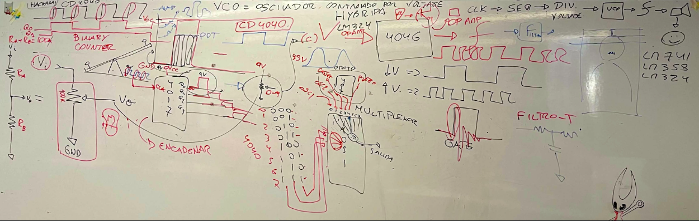

# sesion-11a
hablamos sobre el cap 2 y 3

fuimos a la charla “For Want of (Not) Measuring”

-El proyecto comenzó en 2022.

-La medición y cómo, a veces, decidimos no medir.

-Cuestionar los sistemas de medición que aceptamos sin pensar en su significado.

-Hace 300 años intentaron calcular el peso del mundo escalando una montaña en Escocia con péndulos y telescopios; lograron estimar un 20% del peso del mundo.

-Reflexiona sobre sistemas aparentemente estables que, al observarlos de cerca, revelan su inestabilidad.

-El padre de Jim trabajaba en General Electric, probando ampolletas sobre una grilla en el suelo.

De ahí surge la idea de la cuadrícula de 16 mm:

No es un espacio seguro: encierra una inestabilidad estructural.

El proyecto establece un diálogo con artistas locales en cada lugar donde se presenta.

Han realizado siete exposiciones, algunas con performances según el contexto.

Cada exposición es una nueva versión, adaptada al lugar y acompañada de publicaciones y ediciones limitadas.

Jim produjo vinilos con mica que generan sonido, como una canción.

-Simon Presentó un escáner láser con un espejo que gira en horizontal y vertical.

-El láser choca con el mundo y devuelve la señal al escáner → se generan modelos digitales.

-Ejemplo: un edificio escaneado con 8 millones de puntos.

-Cada punto = un evento del láser con el mundo → forman una nube de puntos.

-La nube no tiene límites: la máquina busca puntos constantemente.

-Más que medir, le interesa el concepto de nube.

Me pareció super interesante cómo los artistas invitan a mirar más allá de los objetos y de los sistemas para los que fueron creados. Aunque a veces las explicaciones podían resultar un poco confusas, era impresionante ver el entusiasmo y el amor que tenían hacia sus proyectos. Esa pasión hacía que todo cobrara sentido y que uno se sintiera parte de la búsqueda: no solo medir el mundo, sino también imaginarlo, cuestionarlo y abrirlo a nuevas interpretaciones. 

Clase 
- **VCC**: límite superior de voltaje. Nunca se puede superar; todo ocurre entre **GND → VCC**.  
- **Relación voltaje–frecuencia**:  
  - Menor voltaje → frecuencia más lenta.  
  - Mayor voltaje → frecuencia más rápida.  
- **Cajas negras**: módulos que se encadenan uno tras otro, cada uno con una función específica.

### Divisor de voltaje
- Dos resistencias complementarias.  
- Ejemplo: `Ra + Rb = 100k`.  
- Entrada `Vi` → salida modulada a otro voltaje.

### VCO (Voltage Controlled Oscillator)
- Convierte voltaje de control en frecuencia.  
- Ejemplo: **CD4046** (PLL con VCO integrado).  
- Caja negra: voltaje bajo → frecuencia lenta; voltaje alto → frecuencia rápida.

### CD4093
- Oscilador con resistencias (LDR, potenciómetro, fija
- Genera frecuencia variable según resistencia/voltaje.

### CD4022 y CD4017
- Ambos son contadores Johnson.  
- **4017**: 10 salidas secuenciales (decodificador decimal).  
- **4022**: 8 salidas secuenciales (octal).  
- Diferencia principal: número de pasos antes de reiniciar.

- **TL074**: cuádruple op-amp JFET, bajo ruido, ideal para audio.  
- **LM741**: clásico op-amp simple, limitado en ancho de banda.  
- **LM358**: doble op-amp, funciona con alimentación simple (0–VCC).  
- **LM324**: cuádruple op-amp, también apto para alimentación simple.

La pizarra mounstrosa de misaa:

. 

Cap 4 y 5
